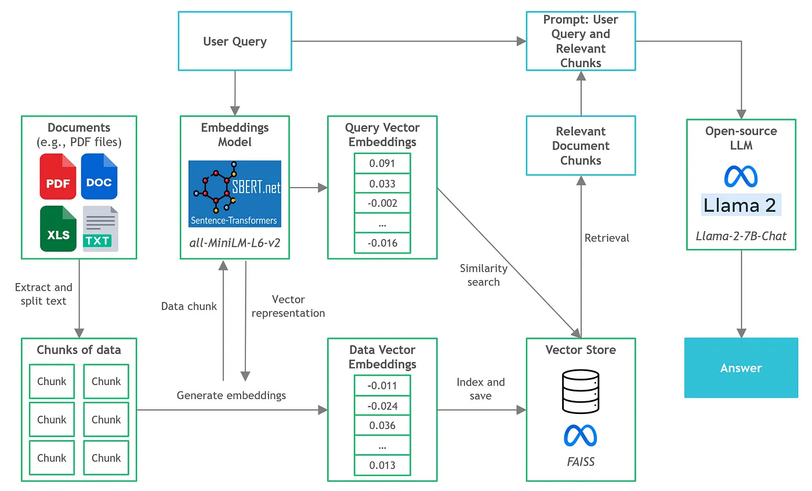
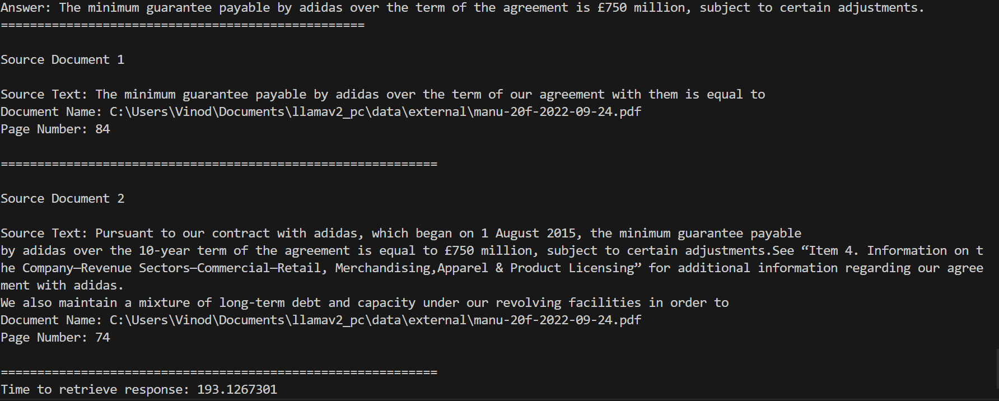

LLAMAv2_PC
==============================

Running Llama 2 on CPU Inference Locally for Document Q&A

Project Organization
------------

    ├── LICENSE
    ├── Makefile           <- Makefile with commands like `make data` or `make train`
    ├── README.md          <- The top-level README for developers using this project.
    ├── data
    │   ├── external       <- Place all the documents here.
    │   ├── interim        <- Intermediate data that has been transformed.
    │   ├── processed       
    │   │   └── db_faiss   <- Index chunks and store in FAISS vector store.
    │   └── raw            <- The original, immutable data dump.
    │
    ├── docs               <- A default Sphinx project; see sphinx-doc.org for details
    │
    ├── models             <- Trained and serialized models, model predictions, or model summaries
    │   ├── all-MiniLM-L6-v2 <- Sentence-Transformers Embeddings Model.
    │   ├── llama-2-7b-chat.ggmlv3.q8_0.bin <- Llama-2–7B-Chat GGML binary file.
    │
    ├── notebooks          <- Jupyter notebooks. Naming convention is a number (for ordering),
    │                         the creator's initials, and a short `-` delimited description, e.g.
    │                         `1.0-jqp-initial-data-exploration`.
    │
    ├── references         <- Data dictionaries, manuals, and all other explanatory materials.
    │
    ├── reports            <- Generated analysis as HTML, PDF, LaTeX, etc.
    │   └── figures        <- Generated graphics and figures to be used in reporting
    │
    ├── requirements.txt   <- The requirements file for reproducing the analysis environment, e.g.
    │                         generated with `pip freeze > requirements.txt`
    │
    ├── setup.py           <- makes project pip installable (pip install -e .) so src can be imported
    ├── src                <- Source code for use in this project.
    │   ├── __init__.py    <- Makes src a Python module
    │   │
    │   ├── data           <- Scripts to download or generate data
    │   │   └── db_build.py
    │   │
    │   ├── features       <- Scripts to turn raw data into features for modeling
    │   │
    │   ├── models         <- Scripts to train models and then use trained models to make
    │   │   │                 predictions
    │   │   ├── llm.py
    │   │   └── prompts.py
    │   │   └── utils.py
    │   │
    │   └── visualization  <- Scripts to create exploratory and results oriented visualizations
    │
    ├── config
    │   ├── config.yml     <- Configuration file for defingin model specific details.
    |
    └── tox.ini            <- tox file with settings for running tox; see tox.testrun.org


--------

# Introduction

In this project, my aim is to explore the implementation of quantized versions of open-source Large Language Models (LLMs) on local CPU inference for retrieval-augmented generation, commonly known as document Question and Answer (Q&A), using Python. Specifically, we will utilize the cutting-edge and highly-performant Llama 2 chat model to achieve our objectives.

# Document Q&A Architecture



# Steps to reproduce

1. Create a virtual environment
```
project_dir>conda create -n llama python=3.9 
```

2. Activate virtual environment
```
project_dir>conda activate llama 

(llama)project_dir>conda create -n llama python=3.9 
```

3. Install the necessary python packages
```
(llama)project_dir>pip install -r requirements.txt
```

4. Place the documents you want to interact in the `data/external` folder

5. Download the `LLaMav2` and `Sentence Transformer` model and place in under `models` folder

6. Define the input, output and model file paths in `config.yml` 

7. Process data and build vector store
```
(llama)project_dir>python src/data/db_build.py
```

8. Running a sample query
```
(llama)project_dir>python main.py "How much is the minimum guarantee payable by adidas?"
```




# References
https://towardsdatascience.com/running-llama-2-on-cpu-inference-for-document-q-a-3d636037a3d8